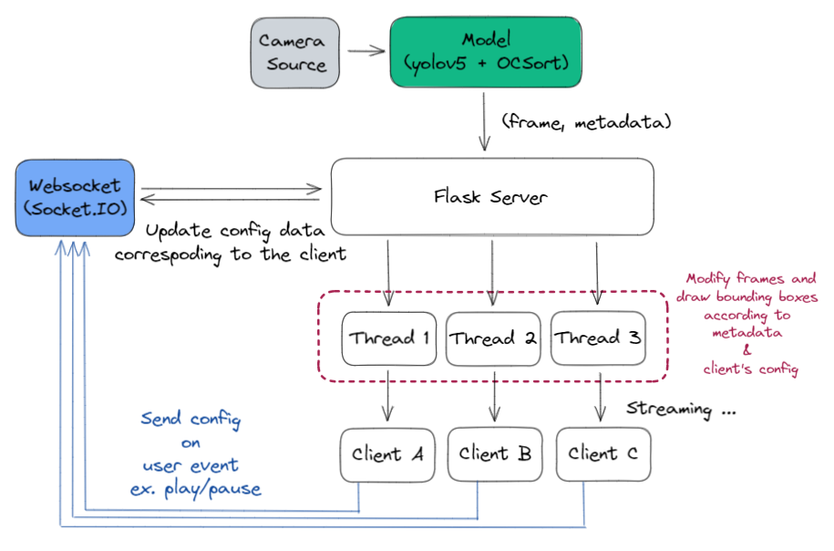

# Video Streaming and Tracking

#### 0816137 王培碩、0816153 陳琮方、0816004 吳原博、311551058 劉冠宏

## Streaming Server




## DNN Structure

使用 yolov5m 作為 detector，外加 OCSort 作為 tracker 和 OSNet 作為 ReID model 以實現 MOT。


## Extensions & How

* Button for user to pause/play
* Specify which class to detect
* Support multiple resolution

對於不同使用者的個人化設定，我們運用一個 config 去紀錄不同使用者的設定，並運用```flask.session```維護，在 server收到使用者 request 時，授予一個唯一的 uid，在後面更改設定的過程中，運用 ```flask.session``` 去知道來源的使用者，並對於個別使用者產生不同的行為。

<div style="page-break-after: always; break-after: page;"></div>


This is the default configuration for a new user:
```python
userConfig[session.get('ID')] = {
    "id": session.get('ID'),
    "resolution": "480p",
    "mode": "original",
    "confidence": 0.5,
    "play": True,
    "show_class_id": [ i for i in range(0, 80) ]
}
```


## Reference
[1] MOT DNN 使用 https://github.com/mikel-brostrom/Yolov5_StrongSORT_OSNet